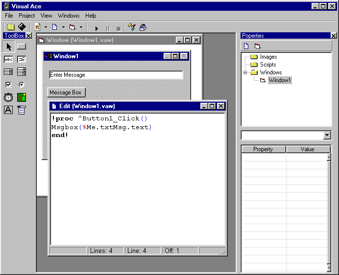



## ASL Scripting Language with IDE

### Description

Ace Scripting Language is a my attempt to create a computer language. It's bundled with an IDE called Visual Ace which includes a dialog editor(window editor), a code editor and a ton of other things. The script functions and commands are fully documented in the IDE via the code browser and it will 'compile' to an executable. An example project is included.

Represents about a years worth of work and a countless amount of rewrites. The actual scripting 'engine' is an older working version that is riddled with poor coding but it works. I have already rewritten the engine for a project and I will release the source code here as well. Please visit http://onlies.net/ for more information.

Code is free to use for non-commercial applications, if you want to use this code in a professional app please contact me.
 
### More Info
 

             |
---                |---
**Submitted On**   |2004-12-08 09:21:54
**By**             |[DoWnLoHo](https://github.com/Planet-Source-Code/PSCIndex/blob/master/ByAuthor/downloho.md)
**Level**          |Advanced
**User Rating**    |4.9 (49 globes from 10 users)
**Compatibility**  |VB 6\.0
**Category**       |[Complete Applications](https://github.com/Planet-Source-Code/PSCIndex/blob/master/ByCategory/complete-applications__1-27.md)
**World**          |[Visual Basic](https://github.com/Planet-Source-Code/PSCIndex/blob/master/ByWorld/visual-basic.md)
**Archive File**   |[ASL\_Script1826881282004\.zip](https://github.com/Planet-Source-Code/downloho-asl-scripting-language-with-ide__1-57608/archive/master.zip)

